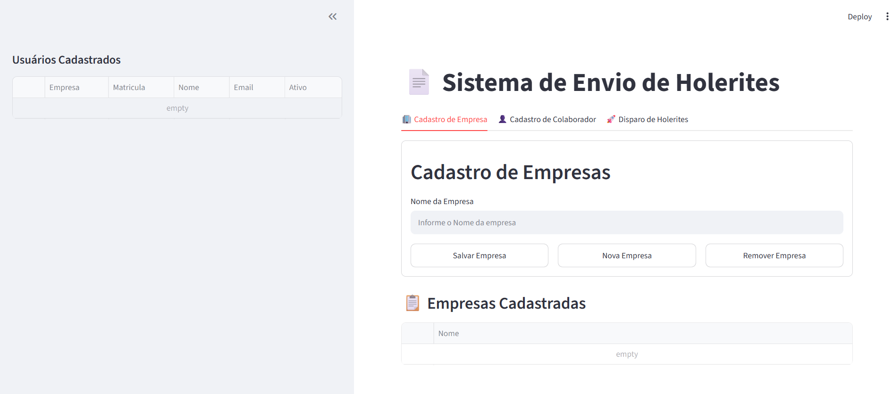
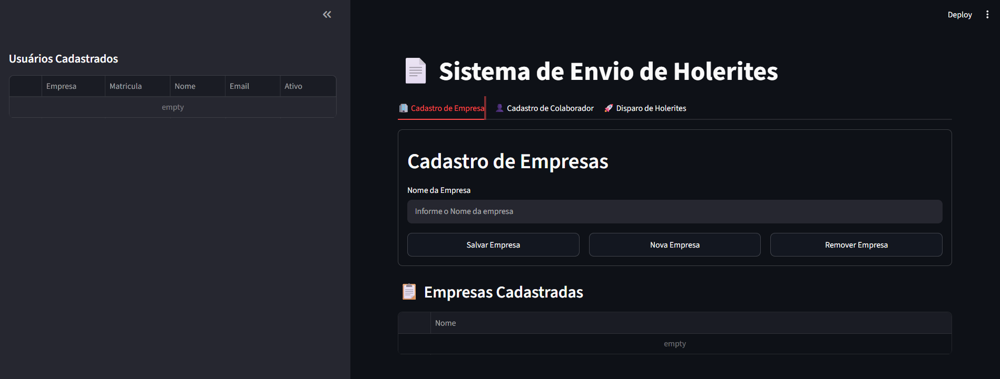
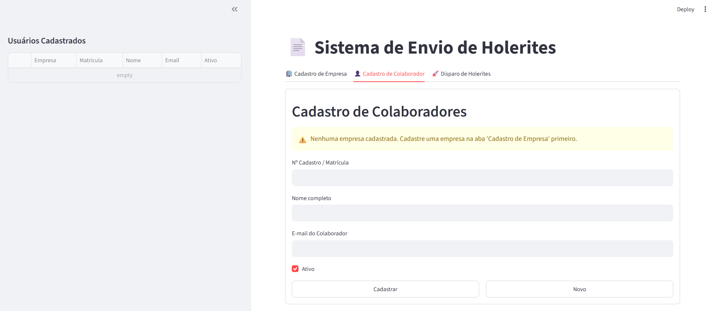
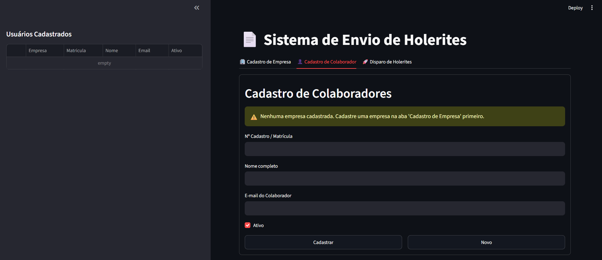
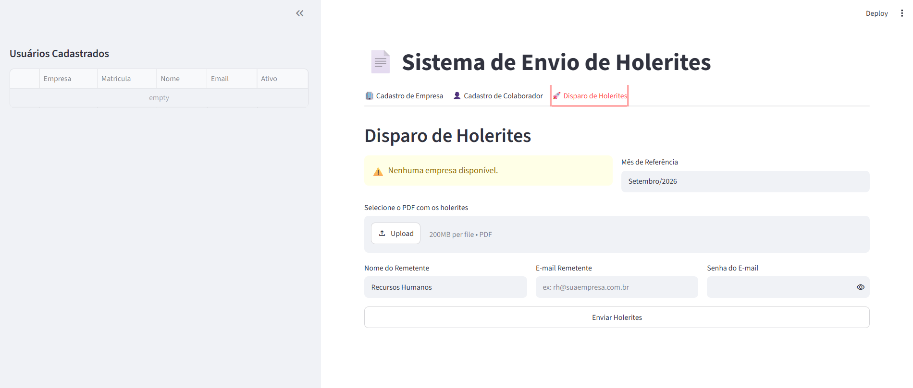
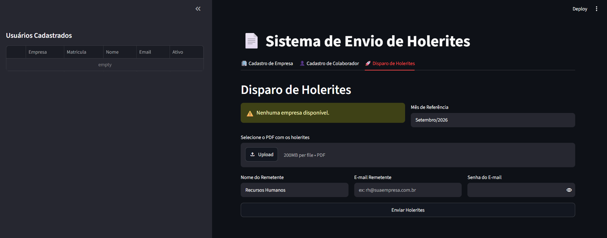

# 📄 Sistema Corporativo de Processamento e Disparo de Holerites

O **Sistema Corporativo de Processamento e Disparo de Holerites** é uma solução desenvolvida em Python com **Streamlit** para automatizar o fluxo do Departamento de Recursos Humanos.

A aplicação lê arquivos PDF unificados contendo múltiplos holerites, identifica cada funcionário pela matrícula, realiza o desmembramento individual dos documentos, organiza os PDFs em uma estrutura hierárquica de pastas e efetua o envio em massa via servidor SMTP corporativo.

---

## 🎨 Temas e Aparência da Interface

A aplicação oferece suporte completo aos temas nativos do Streamlit, adaptando-se confortavelmente às preferências visuais do usuário:

- **Modo Light (Claro)**: Ideal para ambientes bem iluminados.
- **Modo Dark (Escuro)**: Reduz o cansaço visual em jornadas prolongadas.
- **Tema do Sistema**: Acompanha automaticamente a preferência do sistema operacional do usuário.

---

## 📸 Capturas de Tela do Sistema

### 🏢 Aba 1: Cadastro de Empresa

_Gerenciamento dinâmico das empresas atendidas pelo sistema._

|                            Modo Light                             |                            Modo Dark                            |
| :---------------------------------------------------------------: | :-------------------------------------------------------------: |
|  |  |

---

### 👤 Aba 2: Cadastro de Colaborador

_Mapeamento da base de funcionários, e-mails e vínculos organizacionais._

|                                Modo Light                                 |                                Modo Dark                                |
| :-----------------------------------------------------------------------: | :---------------------------------------------------------------------: |
|  |  |

---

### 🚀 Aba 3: Disparo de Holerites

_Painel de controle para envio automatizado, emissão de anexos e relatórios de pendências._

|                             Modo Light                             |                            Modo Dark                             |
| :----------------------------------------------------------------: | :--------------------------------------------------------------: |
|  |  |

---

## 🚀 Tecnologias e Bibliotecas Utilizadas

| Biblioteca / Framework | Descrição                                                                  | Link de Acesso                                                              |
| :--------------------- | :------------------------------------------------------------------------- | :-------------------------------------------------------------------------- |
| **Streamlit**          | Interface web interativa em Python                                         | [streamlit.io](https://streamlit.io/)                                       |
| **PyMuPDF (fitz)**     | Manipulação, leitura e extração de texto em PDFs                           | [pymupdf.readthedocs.io](https://pymupdf.readthedocs.io/)                   |
| **Pandas**             | Leitura, manipulação e persistência de dados em arquivos CSV               | [pandas.pydata.org](https://pandas.pydata.org/)                             |
| **smtplib / ssl**      | Protocolo padrão nativo do Python para comunicação e autenticação SMTP/SSL | [docs.python.org - smtplib](https://docs.python.org/3/library/smtplib.html) |
| **asyncio**            | Gerenciamento e suporte a eventos assíncronos em ambiente Windows          | [docs.python.org - asyncio](https://docs.python.org/3/library/asyncio.html) |

---

## 🖥️ Módulos e Funcionalidades do Sistema

A aplicação é dividida em 3 abas principais e um painel de consulta lateral:

### 🏢 1. Cadastro de Empresa

- Permite cadastrar, editar e remover empresas de forma 100% dinâmica.
- Armazena as empresas cadastradas no arquivo `empresas.csv`.
- Alimenta automaticamente os seletores de empresa presentes nas demais abas do sistema.

### 👤 2. Cadastro de Colaborador

- Gerencia a base de colaboradores (Matrícula, Nome, E-mail, Empresa vinculada e Status de Ativo).
- Armazena os registros no arquivo `colaboradores.csv`.
- **Painel Lateral**: Exibe a lista completa de colaboradores cadastrados, permitindo a seleção rápida para edição ou inativação.

### 🚀 3. Disparo de Holerites

- **Filtro Inteligente**: Permite selecionar a empresa e o mês de referência (ex: `Setembro/2026`).
- **Remetente Dinâmico**: Sincroniza automaticamente o nome do remetente com a empresa escolhida (ex: `Recursos Humanos - INJETAQ`).
- **Desmembramento e Validação**: Lê o lote único em PDF, localiza a matrícula após a instrução _"Nome do Funcionário"_ e desmembra apenas a página pertencente a cada colaborador ativo da empresa.
- **Organização de Pastas**: Salva os PDFs individuais na estrutura hierárquica:
  ```text
  holerites/
  └── [NOME_DA_EMPRESA]/
      └── [MES_REFERENCIA]/
          └── Holerite_[EMPRESA]_[MATRICULA]_[NOME]_[MES].pdf
  ```

* Relatório de Divergências: Ao final do processo, gera e envia automaticamente um e-mail com o resumo de erros/pendências diretamente para a caixa do remetente do RH.

## 🛠️ Passo a Passo para Utilização e Execução

### 📋 Pré-requisitos

- Python 3.9 ou superior instalado na máquina.

- Acesso à rede/servidor SMTP corporativo.

### 📥 1. Clonar ou Baixar o Repositório

Faça o download dos arquivos do projeto ou clone o repositório utilizando o Git:

```Bash
git clone https://github.com/IMoisasZ/envio_holerites_com_streamlit.git
cd envio_holerites_com_streamlit
```

> [Clique aqui para acessar o repositorio](https://github.com/IMoisasZ/envio_holerites_com_streamlit.git)

### 📦 2. Instalar as Bibliotecas Dependentes

- Você pode instalar as dependências de duas formas:

#### Opção A: Instalação automática via `requirements.txt` (Recomendado)

Execute o comando abaixo para instalar todas as dependências do projeto de uma única vez:

```bash
pip install -r requirements.txt
```

#### Opção B: Instalação manual das bibliotecas

Caso prefira instalar biblioteca por biblioteca manualmente no terminal, execute:

```Bash
pip install streamlit pymupdf pandas
```

### 🚀 3. Executar a Aplicação

Para iniciar o servidor local do Streamlit, execute o seguinte comando no terminal:

```Bash
streamlit run codigo.py
```

A aplicação abrirá no seu navegador padrão no endereço:

- http://localhost:8501

## ⚙️ 4. Fluxo de Uso Recomendado

- Cadastrar Empresa: Na primeira aba, cadastre o nome da(s) empresa(s).

- Cadastrar Colaboradores: Na segunda aba, inclua os colaboradores informando a matrícula exata presente nos holerites, nome, e-mail e empresa correspondente.

* Enviar Holerites:

- Vá para a aba Disparo de Holerites.

- Selecione a empresa e informe o mês de referência.

- Faça o upload do PDF único contendo todos os holerites.

- Informe as credenciais do e-mail remetente e clique em Enviar Holerites.

## 👨‍💻 Autor

- Autor: Moises Santos
- GitHub: IMoisasZ
- E-mail: mopri08@gmail.com
